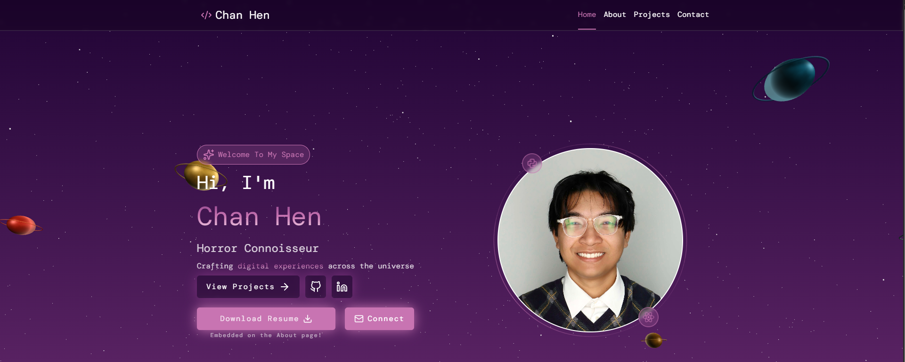

# Chan Hen — Portfolio Website

A personal portfolio website built with **Next.js**, **React**, **GSAP**, and **Tailwind CSS**, featuring smooth scroll-based animations, interactive UI components, and a live **Spotify** integration that displays currently playing tracks.

🌐 **Live Site:** [chanhen.space](https://chanhen.space)



---

## ✨ Features

- **GSAP Scroll Animations** — Scroll-triggered timelines and pin-based effects for immersive storytelling
- **Spotify Integration** — Displays currently playing (or recently played) track via Spotify Web API with OAuth 2.0
- **Responsive Design** — Fully optimized across desktop, tablet, and mobile viewports
- **Next.js App Router** — Server-side rendering and async server components for fast page loads
- **Interactive UI** — Smooth hover effects, transitions, and cursor interactions
- **Dark Aesthetic** — Modern, minimal dark-themed design

---

## 🛠️ Tech Stack

| Layer | Technology |
|---|---|
| Framework | [Next.js](https://nextjs.org/) (App Router) |
| UI Library | [React](https://react.dev/) |
| Styling | [Tailwind CSS](https://tailwindcss.com/) |
| Animations | [GSAP](https://gsap.com/) + ScrollTrigger |
| Music API | [Spotify Web API](https://developer.spotify.com/documentation/web-api) |
| Language | TypeScript |
| Deployment | [Vercel](https://vercel.com/) |

---

## 🚀 Getting Started

### Prerequisites

- Node.js `18+`
- npm or yarn
- A [Spotify Developer](https://developer.spotify.com/dashboard) account and app credentials

### Installation

```bash
# Clone the repository
git clone https://github.com/officialchanhens/portfolio.git
cd portfolio

# Install dependencies
npm install
```

### Environment Variables

Create a `.env.local` file in the root directory and add the following:

```env
SPOTIFY_CLIENT_ID=your_spotify_client_id
SPOTIFY_CLIENT_SECRET=your_spotify_client_secret
SPOTIFY_REFRESH_TOKEN=your_spotify_refresh_token
```

> **Getting your Spotify Refresh Token:**
> Follow the [Spotify Authorization Code Flow](https://developer.spotify.com/documentation/web-api/tutorials/code-flow) to obtain a refresh token with the `user-read-currently-playing` and `user-read-recently-played` scopes.

### Running Locally

```bash
npm run dev
```

Open [http://localhost:3000](http://localhost:3000) in your browser.

---

## 🎵 Spotify Integration

The Spotify widget uses the [Spotify Web API](https://developer.spotify.com/documentation/web-api) to fetch the currently playing track in real time. If no track is actively playing, it falls back to the most recently played track.

The integration uses the **Authorization Code Flow with Refresh Token** — the refresh token is stored server-side as an environment variable and exchanged for short-lived access tokens on each request, keeping credentials secure.

---

## 🎞️ Animations

Animations are powered by [GSAP](https://gsap.com/) and the **ScrollTrigger** plugin:

- **Hero section** — Staggered text and element entrance on page load
- **Scroll timelines** — Pinned sections with progress-based animation sequences
- **Section reveals** — Fade-in and slide-up effects as sections enter the viewport
- **Smooth transitions** — Page-level transitions for a native app feel

---

## 📦 Deployment

The site is deployed on **Vercel**. To deploy your own fork:

1. Push the repository to GitHub
2. Import the project at [vercel.com/new](https://vercel.com/new)
3. Add your environment variables in the Vercel project settings
4. Deploy — Vercel automatically handles builds on every push to `main`

---

## 📄 License

This project is for personal portfolio use. Feel free to use it as inspiration, but please do not copy it directly without permission.

---

Designed & built by Chan Hen
